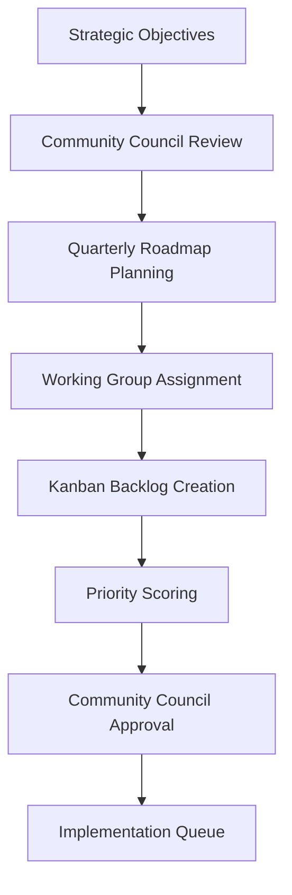
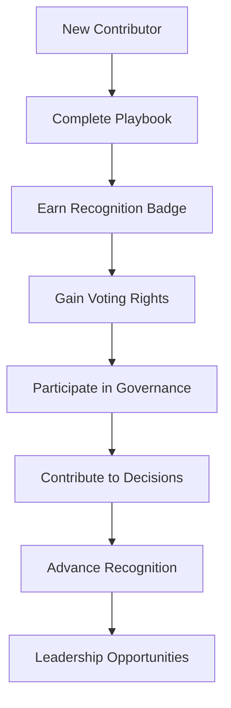

# Governance Charter & Decision Framework

This charter establishes the formal governance structure for NeuroSwarm, defining decision-making processes, conflict resolution mechanisms, and the relationship between community participation and governance rights.

## Preamble

NeuroSwarm operates as a decentralized autonomous organization (DAO) focused on building a verifiable AI model provenance and collaboration ecosystem. This charter ensures transparent, fair, and effective governance that scales with community growth while maintaining technical excellence and security.

**Effective Date:** November 11, 2025
**Version:** 1.0
**Governing Authority:** Community consensus via this charter

## Core Principles

### 1. Transparency
All governance decisions, processes, and outcomes shall be publicly documented and auditable.

### 2. Meritocracy
Decisions prioritize technical merit, community benefit, and long-term sustainability over individual interests.

### 3. Inclusivity
All contributors with demonstrated commitment may participate in governance, with recognition systems ensuring broad representation.

### 4. Accountability
Maintainers and decision-makers are accountable to the community through regular reviews and recall processes.

### 5. Adaptability
Governance processes evolve based on community feedback and changing project needs.

## Governance Structure

### Decision-Making Bodies

#### 1. **Technical Committee** (Core Maintainers)
**Composition:** 5-7 senior contributors elected by community vote
**Term:** 6 months, renewable
**Responsibilities:**
- Final approval of technical architecture decisions
- Code merge authority for critical components
- Emergency response coordination
- Protocol-level decision making

**Election Process:**
- Nominations open for 2 weeks
- Community voting for 1 week using quadratic voting
- Top candidates by weighted vote elected
- Minimum 50 NST staked to vote

#### 2. **Community Council** (Extended Maintainers)
**Composition:** 12 contributors elected by badge-weighted voting
**Term:** 3 months, renewable
**Responsibilities:**
- Roadmap prioritization and quarterly planning
- Budget allocation for bounties and initiatives
- Community dispute resolution
- Strategic partnerships and outreach

**Election Process:**
- Open to all contributors with active badges
- Badge-weighted voting (Gold+ badges = 2x weight, Platinum+ = 3x weight)
- Monthly elections to maintain representation

#### 3. **Working Groups** (Domain Experts)
**Formation:** Ad-hoc groups formed for specific initiatives
**Composition:** 3-8 contributors with relevant expertise
**Duration:** Project-based, dissolves upon completion
**Responsibilities:**
- Execute specific initiatives (e.g., "Security Hardening WG", "Onboarding WG")
- Report progress to Community Council
- Propose changes within their domain

### Voting Rights & Eligibility

#### Badge-Based Governance Rights

| Badge Level | Voting Weight | Eligible Roles | Special Rights |
|-------------|---------------|----------------|----------------|
| **Bronze** (Validator Deployer, Indexer Extender) | 1x | Community Council | Basic proposal submission |
| **Silver** (Test Champion) | 1.5x | Community Council | Working group leadership |
| **Gold** (Network Architect) | 2x | Technical Committee | Code review authority |
| **Platinum** (Security Guardian) | 2.5x | Technical Committee | Security advisory board |
| **Diamond** (Community Builder) | 3x | All committees | Initiative sponsorship |

#### Voting Requirements
- **Minimum Stake:** 10 NST to submit proposals
- **Voting Stake:** 1 NST minimum to vote on proposals
- **Badge Maintenance:** Must maintain active contribution (1 PR/quarter minimum)
- **Conflict Declaration:** Must declare conflicts of interest

## Decision-Making Framework

### Decision Types & Processes

#### 1. **Technical Decisions** (Code & Architecture)

**Light Process (< 2 weeks):**
- RFC submitted via GitHub Discussions
- 5 business days for initial feedback
- Technical Committee approval required
- Implementation proceeds if no objections

**Heavy Process (2-8 weeks):**
- Formal RFC with technical specification
- 2-week community review period
- Working group formed if needed
- Technical Committee final approval
- 2/3 majority required for breaking changes

#### 2. **Strategic Decisions** (Roadmap & Budget)

**Process:**
- Proposal submission (minimum 50 NST stake)
- 1-week community discussion
- Community Council review and refinement
- 2-week community voting period
- Badge-weighted quadratic voting
- 60% approval threshold for implementation

#### 3. **Operational Decisions** (Day-to-day)

**Process:**
- Issue submitted to appropriate working group
- Working group review within 48 hours
- Implementation if consensus reached
- Escalation to Community Council if disputed

### Consensus Thresholds

| Decision Type | Threshold | Voting Period | Appeal Process |
|---------------|-----------|---------------|----------------|
| **Technical (Light)** | Technical Committee consensus | 5 days | Community Council review |
| **Technical (Heavy)** | 2/3 Technical Committee | 2 weeks | Community vote |
| **Strategic** | 60% community approval | 2 weeks | Technical Committee arbitration |
| **Operational** | Working group consensus | 48 hours | Community Council mediation |
| **Emergency** | 3/5 Technical Committee | 24 hours | Immediate community vote |

## Conflict Resolution Framework

### Escalation Levels

#### **Level 1: Peer Resolution** (Informal)
- Direct discussion between parties
- Mediator facilitation if requested
- Resolution documented in issue tracker

#### **Level 2: Working Group Mediation** (Formal)
- Working group assigned as neutral party
- 5-day investigation period
- Binding recommendation issued
- Appeal to Community Council within 7 days

#### **Level 3: Community Council Arbitration** (Binding)
- Full council review of evidence
- 10-day deliberation period
- Final binding decision
- No further appeal except for charter violations

#### **Level 4: Charter Review** (Constitutional)
- Charter interpretation disputes
- Requires 75% community approval
- May result in charter amendments
- 30-day implementation period

### Dispute Categories

#### **Technical Disputes**
- Code quality or architecture disagreements
- Handled by Technical Committee
- Focus on technical merit and standards

#### **Resource Disputes**
- Budget allocation or priority conflicts
- Handled by Community Council
- Focus on project impact and fairness

#### **Behavioral Disputes**
- Code of conduct violations
- Handled by Community Council
- Reference to Code of Conduct enforcement guidelines

#### **Governance Disputes**
- Charter interpretation or process violations
- Handled by full community vote
- May result in governance reforms

## Roadmap Prioritization Framework

### Objective-to-Task Flow



#### Priority Scoring System

**Impact Score (1-5):**
- 5: Critical path blocker, affects core functionality
- 4: Major feature, significant user impact
- 3: Important improvement, community requested
- 2: Nice-to-have, incremental improvement
- 1: Minor enhancement, low impact

**Effort Score (1-5):**
- 1: < 1 day, trivial implementation
- 2: 1-3 days, straightforward
- 3: 1-2 weeks, moderate complexity
- 4: 1-2 months, significant work
- 5: 3+ months, major initiative

**Priority Formula:** `(Impact × 2) + (6 - Effort)`
- **High Priority:** Score ≥ 9
- **Medium Priority:** Score 6-8
- **Low Priority:** Score ≤ 5

#### Quarterly Planning Cycle

**Month 1 (Planning):**
- Review completed objectives
- Community feedback collection
- Working group formation
- Draft roadmap creation

**Month 2 (Prioritization):**
- Priority scoring of all items
- Resource allocation planning
- Dependency mapping
- Community Council review

**Month 3 (Execution):**
- Kanban backlog population
- Sprint planning and assignment
- Progress tracking and reporting
- Mid-quarter adjustments

## Transparency & Auditability

### Decision Records

All governance decisions shall be recorded in a public decision log:

**Decision Log Format:**
```markdown
# Decision Log Entry

**Date:** YYYY-MM-DD
**Decision ID:** GOV-YYYY-NNN
**Type:** [Technical/Strategic/Operational]
**Proposer:** Contributor Name
**Status:** [Proposed/Approved/Rejected/Pending]

## Context
[Brief description of the issue or opportunity]

## Options Considered
1. Option A: [Description, pros/cons]
2. Option B: [Description, pros/cons]
3. Option C: [Description, pros/cons]

## Decision
[Chosen option and rationale]

## Implementation
[How the decision will be executed]

## Stakeholders
[List of affected parties and communication plan]

## Review Date
[When this decision should be reviewed]
```

### Audit Trail Requirements

- **Version Control:** All governance documents versioned in Git
- **Timestamping:** All decisions timestamped and immutable
- **Public Access:** Decision logs publicly accessible
- **Regular Audits:** Quarterly governance effectiveness reviews

### Transparency Metrics

- **Decision Velocity:** Average time from proposal to decision
- **Participation Rate:** Percentage of eligible voters participating
- **Satisfaction Score:** Community satisfaction with governance processes
- **Appeal Rate:** Frequency of decision appeals

## Community Scaling Integration

### Badge-to-Governance Pipeline



#### Recognition-Governance Integration

**Bronze Level (Entry):**
- Basic voting rights on operational decisions
- Proposal submission capability
- Access to community channels

**Silver Level (Contributor):**
- Working group participation
- Enhanced voting weight
- Community Council eligibility

**Gold Level (Maintainer):**
- Technical Committee eligibility
- Code merge authority
- Initiative leadership

**Platinum+ Level (Leader):**
- Strategic decision authority
- Budget allocation rights
- External representation

### Scaling Mechanisms

#### **Automated Onboarding**
- Playbook completion triggers badge awards
- Badge awards automatically grant governance rights
- Clear progression path reduces friction

#### **Mentorship Integration**
- Experienced contributors mentor newcomers
- Governance participation as teaching opportunity
- Leadership development pipeline

#### **Feedback Loops**
- Regular governance satisfaction surveys
- Process improvement based on community input
- Adaptive governance evolution

## Emergency Governance

### Emergency Declaration

**Criteria:**
- Critical security vulnerability
- Network outage affecting >50% of nodes
- Financial loss >10% of treasury
- Legal or regulatory compliance issue

**Process:**
1. Technical Committee declares emergency (3/5 majority)
2. 24-hour emergency voting period
3. Immediate implementation of approved measures
4. 72-hour post-mortem and full community review

### Emergency Powers

During declared emergencies, Technical Committee may:
- Temporarily suspend normal governance processes
- Implement security patches without full review
- Restrict network access to protect integrity
- Allocate emergency funds for remediation

**Sunset Clause:** Emergency powers expire after 7 days unless extended by community vote.

## Charter Amendment Process

### Amendment Proposal

1. **Submission:** Any contributor may propose charter amendments
2. **Stake:** Minimum 100 NST stake required
3. **Review:** 30-day community review period
4. **Voting:** Badge-weighted quadratic voting
5. **Threshold:** 75% approval required

### Amendment Categories

#### **Minor Amendments** (Editorial, Clarification)
- 60% approval threshold
- 14-day review period
- Technical Committee approval

#### **Major Amendments** (Structural Changes)
- 75% approval threshold
- 30-day review period
- Full community vote required

#### **Constitutional Amendments** (Core Principles)
- 85% approval threshold
- 60-day review period
- Requires working group analysis
- Independent audit recommended

## Implementation Timeline

### Phase 1: Foundation (Q4 2025)
- [x] Governance charter ratification
- [x] Technical Committee election
- [x] Initial badge system implementation
- [ ] Decision log infrastructure setup

### Phase 2: Scaling (Q1 2026)
- [ ] Community Council formation
- [ ] Working group framework implementation
- [ ] Roadmap prioritization system launch

### Phase 3: Optimization (Q2 2026)
- [ ] Governance metrics dashboard
- [ ] Automated badge-governance integration
- [ ] Community feedback system implementation

## Success Metrics

### Governance Health
- **Participation Rate:** >40% of eligible voters participate in major decisions
- **Decision Velocity:** <14 days average for strategic decisions
- **Appeal Rate:** <5% of decisions appealed
- **Satisfaction Score:** >4.0/5.0 in quarterly surveys

### Community Growth
- **Active Contributors:** 200+ monthly active contributors
- **Badge Distribution:** 500+ active recognition badges
- **Working Groups:** 10+ active domain-specific groups
- **Event Participation:** 50+ community events annually

### Project Outcomes
- **Code Quality:** 90%+ test coverage maintained
- **Security:** Zero critical vulnerabilities in production
- **Innovation:** 25+ major features delivered annually
- **Adoption:** 10,000+ active network participants

---

**This charter establishes the foundation for transparent, participatory governance that scales with NeuroSwarm's growth. It ensures contributors are empowered to shape the project's future while maintaining technical excellence and community trust.**

*Ratified by community consensus on November 11, 2025*