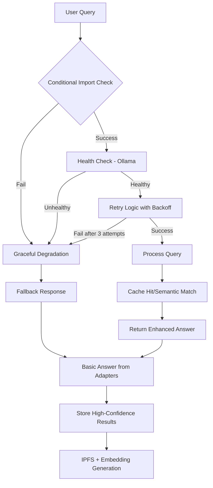

# 👩‍💻 Developer Guide

This guide is for developers who want to build NeuroSwarm from source or contribute to the project.

## Build from Source

### Prerequisites
- Node.js v18+
- Git

### Steps

1. **Clone the Repository**
   ```bash
   git clone https://github.com/brockhager/neuro-infra.git
   cd neuro-infra/neuroswarm
   ```

2. **Install Dependencies**
   ```bash
   npm install
   ```

3. **Start the Node**
   ```bash
   npm start
   ```

### Building Binaries
To create standalone executables for Windows, Linux, and macOS:

```bash
npm run build:bin
```

The binaries will be output to `../neuroswarm/dist/`.
You can then upload these files to your server.

## Architecture
See the [System Overview](System-Overview/README.md) for details on the architecture.

## 🛡️ Resilience Workflow

NeuroSwarm implements a comprehensive error handling and recovery system:



**Key Components:**
- **Conditional Imports**: Services load dynamically, preventing startup crashes
- **Health Checks**: Runtime verification of dependencies (Ollama, IPFS)
- **Retry Logic**: 3-attempt exponential backoff for external API calls
- **Graceful Degradation**: System continues operating with reduced features
- **Fallback Responses**: Clear messaging when services are unavailable

## 🤝 Contributor Workflows

### Knowledge Processing Pipeline

When a user submits a query, NeuroSwarm follows this evaluation process:

1. **Query Analysis**: Detect question type and intent
2. **Adapter Selection**: Choose appropriate data sources (math, crypto, news, etc.)
3. **Cache Lookup**: Check IPFS knowledge base for similar queries
4. **Semantic Matching**: Use embeddings for paraphrase detection (if Ollama available)
5. **Confidence Scoring**: Evaluate answer quality and source reliability
6. **Storage Decision**: Cache high-confidence answers to IPFS with embeddings

### When Ollama is Unavailable

If the local Ollama instance is not running, the system gracefully degrades:

- **Semantic features disabled**: No embedding generation or similarity search
- **Keyword fallback**: Uses exact/keyword matching instead of semantic search
- **Clear messaging**: Users are informed about limited functionality
- **Continued operation**: All other features (adapters, IPFS storage) work normally

To enable full semantic features:
1. Install Ollama: `curl -fsSL https://ollama.ai/install.sh | sh`
2. Pull the model: `ollama pull llama3.2`
3. Start Ollama: `ollama serve`
4. Restart NeuroSwarm node

### Monitoring and Metrics

Access the contributor dashboard at `http://localhost:3009/dashboard` for:
- Real-time system health status
- Knowledge base statistics
- Semantic feature availability
- Performance metrics and trends
