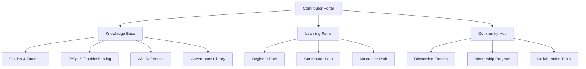

# Knowledge Base & Contributor Portal

This document outlines the NeuroSwarm Contributor Portal - a unified knowledge base and entry point that makes the entire governance ecosystem discoverable, searchable, and confidence-scored. The portal transforms our distributed documentation into an accessible, trustworthy resource for community scaling.

## Overview

The Contributor Portal serves as the single source of truth for NeuroSwarm participation, combining playbooks, governance, and documentation into an integrated experience. By extending our provenance model to documentation, we create a self-improving knowledge ecosystem where content quality is attested and discoverable.

**Core Features:**
- **Unified Search:** Cross-document search with relevance ranking
- **Personalized Onboarding:** Role-based content recommendations
- **Confidence Scoring:** Documentation quality attested by community
- **Interactive Learning:** Guided paths through governance and contribution
- **Community Hub:** Forums, mentorship matching, and collaboration tools

## Portal Architecture

### Content Structure



### Technical Implementation

#### Portal Framework
```typescript
// portal/src/types/index.ts
interface ContributorPortal {
  user: UserProfile;
  knowledgeBase: KnowledgeBase;
  learningPaths: LearningPath[];
  communityHub: CommunityHub;
  searchIndex: SearchIndex;
}

interface KnowledgeBase {
  guides: Guide[];
  faqs: FAQ[];
  troubleshooting: Troubleshooting[];
  apiReference: APIReference;
  governanceDocs: GovernanceDoc[];
}

interface LearningPath {
  id: string;
  title: string;
  description: string;
  targetRole: ContributorRole;
  steps: LearningStep[];
  prerequisites: string[];
  estimatedTime: number;
  confidence: number;
}
```

#### Search & Discovery Engine
```typescript
// portal/src/search/index.ts
class PortalSearch {
  private index: SearchIndex;

  async search(query: string, filters: SearchFilters): Promise<SearchResult[]> {
    // Cross-document search with confidence weighting
    const results = await this.index.search(query, filters);

    // Apply confidence scoring
    return results.map(result => ({
      ...result,
      confidence: await this.calculateConfidence(result),
      relevance: this.calculateRelevance(result, query)
    })).sort((a, b) => b.relevance - a.relevance);
  }

  private async calculateConfidence(content: Content): Promise<number> {
    // Extend provenance model to documentation
    const attestations = await this.getAttestations(content.id);
    return this.computeConfidenceScore(attestations);
  }
}
```

## Knowledge Base System

### Curated Content Categories

#### 1. Getting Started Guides
**Purpose:** Lower the barrier to entry for new contributors

**Content Types:**
- **Quick Start:** 5-minute setup guides
- **First Contribution:** Step-by-step first PR walkthrough
- **Environment Setup:** Development environment configuration
- **Tooling Overview:** Essential tools and workflows

**Example Structure:**
```
📚 Getting Started
├── 🚀 Quick Start (5 min)
├── 🛠️ Environment Setup (15 min)
├── 📝 First Contribution (30 min)
├── 🧰 Essential Tools (20 min)
└── ❓ Common Issues (10 min)
```

#### 2. Role-Based Playbooks
**Purpose:** Provide actionable paths for different contributor types

**Playbook Categories:**
- **Validator Operators:** Node deployment, monitoring, troubleshooting
- **API Developers:** Service integration, endpoint development
- **Documentation Contributors:** Writing, validation, maintenance
- **Governance Participants:** Voting, proposal creation, dispute resolution

#### 3. Troubleshooting Hub
**Purpose:** Self-service problem resolution

**Organization:**
- **By Symptom:** "Build fails", "Tests timeout", "Network issues"
- **By Component:** "Validator node", "Indexer service", "API gateway"
- **By Error Code:** Specific error messages with solutions
- **By Environment:** Local dev, staging, production differences

#### 4. FAQ System
**Purpose:** Address common questions proactively

**Categories:**
- **Technical FAQs:** Code-related questions
- **Process FAQs:** Contribution workflow questions
- **Governance FAQs:** Rules and decision-making questions
- **Community FAQs:** Social and cultural questions

### Content Curation Process

#### Automated Curation
```javascript
// scripts/curate-content.js
class ContentCurator {
  async curateContent() {
    const content = await this.gatherAllContent();

    // Extract FAQs from GitHub issues
    const faqs = await this.extractFAQsFromIssues();

    // Generate troubleshooting from error logs
    const troubleshooting = await this.generateTroubleshooting();

    // Update knowledge base
    await this.updateKnowledgeBase({
      faqs,
      troubleshooting,
      guides: content.guides,
      tutorials: content.tutorials
    });
  }
}
```

#### Community Curation
- **Content Suggestions:** Contributors can propose new guides
- **Quality Reviews:** Working group reviews and approves content
- **Usage Analytics:** Track which content is most helpful
- **Gap Analysis:** Identify missing content based on search queries

## Confidence Scoring for Documentation

### Extending the Provenance Model

#### Documentation Attestations
```rust
// neuro-program/programs/neuro-program/src/instructions/attest_doc.rs
#[derive(Accounts)]
pub struct AttestDoc<'info> {
    #[account(mut)]
    pub attestor: Signer<'info>,

    #[account(
        init_if_needed,
        payer = attestor,
        space = 8 + 32 + 32 + 8 + 1 + 200,
        seeds = [b"doc_attestation", doc_hash.as_ref(), attestor.key().as_ref()],
        bump
    )]
    pub attestation: Account<'info, DocAttestation>,

    pub system_program: Program<'info, System>,
}

#[derive(AnchorSerialize, AnchorDeserialize, Clone)]
pub struct DocAttestation {
    pub doc_hash: [u8; 32],      // SHA-256 of document content
    pub attestor: Pubkey,        // Who attested
    pub confidence: u8,          // 0-100 confidence score
    pub accuracy: u8,            // 0-100 accuracy assessment
    pub timestamp: i64,          // When attested
    pub stake_amount: u64,       // NST staked on attestation
}
```

#### Confidence Calculation
```typescript
// portal/src/confidence/index.ts
class DocConfidenceCalculator {
  async calculateConfidence(docId: string): Promise<ConfidenceScore> {
    const attestations = await this.getDocAttestations(docId);
    const baseScore = this.computeBaseScore(attestations);

    // Apply reputation weighting
    const weightedScore = await this.applyReputationWeighting(attestations);

    // Consider recency
    const recencyMultiplier = this.calculateRecencyMultiplier(attestations);

    // Apply stake-based credibility
    const stakeMultiplier = this.calculateStakeMultiplier(attestations);

    return {
      score: Math.min(100, baseScore * weightedScore * recencyMultiplier * stakeMultiplier),
      attestations: attestations.length,
      lastUpdated: this.getLatestAttestationTime(attestations),
      stakeTotal: attestations.reduce((sum, a) => sum + a.stakeAmount, 0)
    };
  }
}
```

### Confidence Display & Usage

#### Visual Indicators
```jsx
// portal/src/components/DocConfidence.jsx
function DocConfidence({ confidence }) {
  const getConfidenceColor = (score) => {
    if (score >= 90) return '🟢';      // High confidence
    if (score >= 70) return '🟡';      // Medium confidence
    if (score >= 50) return '🟠';      // Low confidence
    return '🔴';                      // Needs review
  };

  const getConfidenceLabel = (score) => {
    if (score >= 90) return 'Verified';
    if (score >= 70) return 'Reliable';
    if (score >= 50) return 'Caution';
    return 'Review Needed';
  };

  return (
    <div className="confidence-indicator">
      <span className="confidence-icon">{getConfidenceColor(confidence.score)}</span>
      <span className="confidence-score">{confidence.score}/100</span>
      <span className="confidence-label">{getConfidenceLabel(confidence.score)}</span>
      <span className="attestation-count">({confidence.attestations} attestations)</span>
    </div>
  );
}
```

#### Search Result Ranking
```typescript
// portal/src/search/ranking.ts
class SearchResultRanker {
  rankResults(results: SearchResult[], query: string): SearchResult[] {
    return results
      .map(result => ({
        ...result,
        score: this.calculateCompositeScore(result, query)
      }))
      .sort((a, b) => b.score - a.score);
  }

  private calculateCompositeScore(result: SearchResult, query: string): number {
    const textRelevance = this.calculateTextRelevance(result.content, query);
    const confidenceWeight = result.confidence.score / 100;
    const recencyWeight = this.calculateRecencyWeight(result.lastUpdated);
    const usageWeight = Math.log(result.viewCount + 1) / Math.log(100);

    return (textRelevance * 0.4) +
           (confidenceWeight * 0.3) +
           (recencyWeight * 0.2) +
           (usageWeight * 0.1);
  }
}
```

## Learning Paths & Onboarding

### Personalized Learning Journeys

#### Role-Based Paths
```typescript
// portal/src/learning/paths.ts
const LEARNING_PATHS: Record<ContributorRole, LearningPath> = {
  BEGINNER: {
    id: 'beginner-path',
    title: 'Welcome to NeuroSwarm',
    steps: [
      { id: 'setup', title: 'Environment Setup', duration: 15, required: true },
      { id: 'first-pr', title: 'Your First Contribution', duration: 30, required: true },
      { id: 'governance', title: 'Understanding Governance', duration: 20, required: true },
      { id: 'community', title: 'Joining the Community', duration: 10, required: false }
    ],
    estimatedTime: 75,
    prerequisites: []
  },

  CONTRIBUTOR: {
    id: 'contributor-path',
    title: 'Active Contributor Journey',
    steps: [
      { id: 'playbooks', title: 'Master Playbooks', duration: 60, required: true },
      { id: 'testing', title: 'Testing Excellence', duration: 45, required: true },
      { id: 'governance-participation', title: 'Governance Participation', duration: 30, required: true },
      { id: 'mentorship', title: 'Mentoring Others', duration: 20, required: false }
    ],
    estimatedTime: 155,
    prerequisites: ['beginner-path']
  },

  MAINTAINER: {
    id: 'maintainer-path',
    title: 'Maintainer Leadership',
    steps: [
      { id: 'code-review', title: 'Advanced Code Review', duration: 40, required: true },
      { id: 'governance-leadership', title: 'Governance Leadership', duration: 50, required: true },
      { id: 'community-building', title: 'Community Building', duration: 35, required: true },
      { id: 'project-management', title: 'Project Management', duration: 45, required: false }
    ],
    estimatedTime: 170,
    prerequisites: ['contributor-path']
  }
};
```

#### Progress Tracking
```typescript
// portal/src/learning/progress.ts
class LearningProgressTracker {
  async updateProgress(userId: string, stepId: string, completed: boolean) {
    const progress = await this.getUserProgress(userId);
    const step = progress.paths.find(p => p.steps.some(s => s.id === stepId));

    if (step) {
      const stepProgress = step.steps.find(s => s.id === stepId);
      if (stepProgress) {
        stepProgress.completed = completed;
        stepProgress.completedAt = completed ? Date.now() : null;

        // Check for badge eligibility
        await this.checkBadgeEligibility(userId, step);

        // Update learning recommendations
        await this.updateRecommendations(userId);
      }
    }

    await this.saveProgress(progress);
  }
}
```

### Interactive Onboarding

#### Welcome Flow
```jsx
// portal/src/components/WelcomeFlow.jsx
function WelcomeFlow({ user }) {
  const [currentStep, setCurrentStep] = useState(0);
  const [answers, setAnswers] = useState({});

  const steps = [
    {
      title: "What brings you to NeuroSwarm?",
      options: [
        { value: 'learn', label: 'Learn about decentralized AI' },
        { value: 'contribute', label: 'Contribute to the project' },
        { value: 'build', label: 'Build on NeuroSwarm' },
        { value: 'research', label: 'Research the technology' }
      ]
    },
    {
      title: "What's your background?",
      options: [
        { value: 'beginner', label: 'New to open source' },
        { value: 'developer', label: 'Software developer' },
        { value: 'researcher', label: 'AI/ML researcher' },
        { value: 'devops', label: 'DevOps/Infrastructure' }
      ]
    },
    {
      title: "How much time can you commit?",
      options: [
        { value: 'minimal', label: 'A few hours/week' },
        { value: 'moderate', label: '10-20 hours/week' },
        { value: 'significant', label: 'Full-time contributor' }
      ]
    }
  ];

  const handleComplete = async () => {
    // Generate personalized learning path
    const path = await generatePersonalizedPath(answers);

    // Set up user profile
    await initializeUserProfile(user.id, {
      interests: answers,
      learningPath: path,
      onboardingComplete: true
    });

    // Redirect to personalized dashboard
    navigate('/portal/dashboard');
  };

  return (
    <OnboardingWizard
      steps={steps}
      currentStep={currentStep}
      onStepChange={setCurrentStep}
      onComplete={handleComplete}
      answers={answers}
      onAnswerChange={setAnswers}
    />
  );
}
```

## Community Hub Integration

### Discussion Forums

#### Structured Categories
```
🗣️ Community Hub
├── 💬 General Discussion
│   ├── Introductions
│   ├── General Chat
│   └── Announcements
├── 🛠️ Technical Help
│   ├── Development
│   ├── Deployment
│   └── Troubleshooting
├── 📚 Documentation
│   ├── Suggestions
│   ├── Corrections
│   └── Translations
├── 🏛️ Governance
│   ├── Proposals
│   ├── Voting Discussion
│   └── Decision Reviews
└── 🎯 Special Interest
    ├── AI Research
    ├── Blockchain
    └── Community Events
```

#### Quality Assurance
```typescript
// portal/src/forum/moderation.ts
class ForumModerator {
  async moderatePost(post: ForumPost): Promise<ModerationResult> {
    // Automated checks
    const spamScore = await this.checkSpam(post);
    const qualityScore = await this.assessQuality(post);

    // Community guidelines check
    const guidelineCheck = await this.checkGuidelines(post);

    // Confidence scoring for answers
    if (post.type === 'answer') {
      const confidence = await this.calculateAnswerConfidence(post);
      post.confidence = confidence;
    }

    return {
      approved: spamScore < 0.8 && qualityScore > 0.6 && guidelineCheck.passed,
      flags: [...spamScore > 0.5 ? ['potential-spam'] : [],
              ...qualityScore < 0.4 ? ['low-quality'] : []],
      suggestions: guidelineCheck.suggestions
    };
  }
}
```

### Mentorship Program

#### Automated Matching
```typescript
// portal/src/mentorship/matching.ts
class MentorshipMatcher {
  async findMentor(mentee: UserProfile): Promise<UserProfile[]> {
    const potentialMentors = await this.getActiveMentors();

    return potentialMentors
      .map(mentor => ({
        mentor,
        score: this.calculateMatchScore(mentee, mentor)
      }))
      .filter(match => match.score > 0.7)
      .sort((a, b) => b.score - a.score)
      .slice(0, 3)
      .map(match => match.mentor);
  }

  private calculateMatchScore(mentee: UserProfile, mentor: UserProfile): number {
    let score = 0;

    // Skills alignment
    const skillOverlap = this.calculateSkillOverlap(mentee.skills, mentor.skills);
    score += skillOverlap * 0.4;

    // Experience level match
    const experienceMatch = this.calculateExperienceMatch(mentee.level, mentor.level);
    score += experienceMatch * 0.3;

    // Availability
    const availabilityMatch = mentor.availability / 40; // hours/week
    score += availabilityMatch * 0.2;

    // Past mentorship success
    const successRate = mentor.mentorshipSuccessRate || 0.8;
    score += successRate * 0.1;

    return score;
  }
}
```

## Portal Analytics & Optimization

### Usage Analytics

#### Content Performance
```typescript
// portal/src/analytics/content.ts
class ContentAnalytics {
  async analyzeContentPerformance() {
    const content = await this.getAllContent();

    return content.map(item => ({
      id: item.id,
      title: item.title,
      views: item.viewCount,
      helpfulVotes: item.helpfulVotes,
      timeToRead: item.averageReadTime,
      completionRate: item.completionRate,
      searchRank: item.searchPosition,
      confidence: item.confidence,

      // Derived metrics
      engagement: this.calculateEngagement(item),
      effectiveness: this.calculateEffectiveness(item),
      optimization: this.generateOptimizationSuggestions(item)
    }));
  }

  private calculateEngagement(item: ContentItem): number {
    return (item.helpfulVotes / Math.max(item.views, 1)) * 100;
  }

  private calculateEffectiveness(item: ContentItem): number {
    return item.completionRate * item.confidence / 100;
  }
}
```

#### Personalization Engine
```typescript
// portal/src/personalization/index.ts
class PersonalizationEngine {
  async getPersonalizedContent(userId: string): Promise<PersonalizedContent> {
    const user = await this.getUserProfile(userId);
    const history = await this.getUserHistory(userId);

    // Content recommendations
    const recommendations = await this.generateRecommendations(user, history);

    // Learning path adjustments
    const pathAdjustments = await this.adjustLearningPath(user, history);

    // Community connections
    const connections = await this.suggestConnections(user);

    return {
      recommendations,
      pathAdjustments,
      connections,
      nextSteps: this.generateNextSteps(user, history)
    };
  }
}
```

## Implementation Roadmap

### Phase 1: Foundation (Q4 2025)
- [x] Portal framework and basic structure
- [x] Knowledge base content organization
- [ ] Basic search functionality
- [ ] Learning path framework

### Phase 2: Enhancement (Q1 2026)
- [ ] Confidence scoring system
- [ ] Advanced search and filtering
- [ ] Community hub integration
- [ ] Basic analytics

### Phase 3: Optimization (Q2 2026)
- [ ] AI-powered personalization
- [ ] Advanced mentorship matching
- [ ] Comprehensive analytics dashboard
- [ ] Mobile-responsive design

## Success Metrics

### User Engagement
- **Daily Active Users:** 500+ portal visitors
- **Content Consumption:** 10,000+ page views monthly
- **Learning Completion:** 70%+ path completion rates
- **Community Participation:** 200+ forum posts monthly

### Content Quality
- **High Confidence Content:** 80%+ of docs with 90+ confidence scores
- **Search Satisfaction:** 85%+ search result satisfaction
- **Helpful Content:** 75%+ of content marked helpful by users
- **Update Frequency:** <7 days average content freshness

### Community Growth
- **New Contributor Conversion:** 60%+ of portal visitors make first contribution
- **Mentorship Matches:** 150+ active mentorship relationships
- **Event Participation:** 500+ workshop/hackathon participants annually
- **Retention Rate:** 80%+ contributor retention after 6 months

---

**The Contributor Portal transforms NeuroSwarm's governance ecosystem into a discoverable, trustworthy, and personalized experience. By extending provenance to documentation and creating unified access to all resources, we enable seamless community scaling while maintaining the highest standards of quality and transparency.**

*Portal design finalized: November 11, 2025*