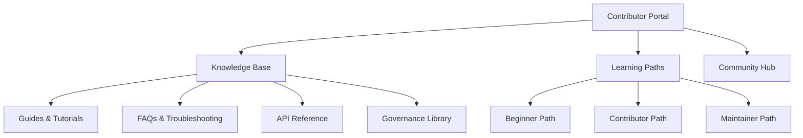

# Knowledge Base & Contributor Portal

This document outlines the NeuroSwarm Contributor Portal - a unified knowledge base and entry point that makes the entire governance ecosystem discoverable, searchable, and confidence-scored. The portal transforms our distributed documentation into an accessible, trustworthy resource for community scaling.

## Overview

The Contributor Portal serves as the single source of truth for NeuroSwarm participation, combining playbooks, governance, and documentation into an integrated experience. By extending our provenance model to documentation, we create a self-improving knowledge ecosystem where content quality is attested and discoverable.

**Core Features:**
- **Unified Search:** Cross-document search with relevance ranking
- **Personalized Onboarding:** Role-based content recommendations
- **Confidence Scoring:** Documentation quality attested by community
- **Interactive Learning:** Guided paths through governance and contribution
- **Community Hub:** Forums, mentorship matching, and collaboration tools

## Portal Architecture

### Content Structure



### Technical Implementation

#### Portal Framework
```typescript
// portal/src/types/index.ts
interface ContributorPortal {
  user: UserProfile;
  knowledgeBase: KnowledgeBase;
  learningPaths: LearningPath[];
  communityHub: CommunityHub;
  searchIndex: SearchIndex;
}

interface KnowledgeBase {
  guides: Guide[];
  faqs: FAQ[];
  troubleshooting: Troubleshooting[];
  apiReference: APIReference;
  governanceDocs: GovernanceDoc[];
}

interface LearningPath {
  id: string;
  title: string;
  description: string;
  targetRole: ContributorRole;
  steps: LearningStep[];
  prerequisites: string[];
  estimatedTime: number;
  confidence: number;
}
```

#### Search & Discovery Engine
```typescript
// portal/src/search/index.ts
class PortalSearch {
  private index: SearchIndex;

  async search(query: string, filters: SearchFilters): Promise<SearchResult[]> {
    // Cross-document search with confidence weighting
    const results = await this.index.search(query, filters);

    // Apply confidence scoring
    return results.map(result => ({
      ...result,
      confidence: await this.calculateConfidence(result),
      relevance: this.calculateRelevance(result, query)
    })).sort((a, b) => b.relevance - a.relevance);
  }

  private async calculateConfidence(content: Content): Promise<number> {
    // Extend provenance model to documentation
    const attestations = await this.getAttestations(content.id);
    return this.computeConfidenceScore(attestations);
  }
}
```

## Knowledge Base System

### Curated Content Categories

#### 1. Getting Started Guides
**Purpose:** Lower the barrier to entry for new contributors

**Content Types:**
- **Quick Start:** 5-minute setup guides
- **First Contribution:** Step-by-step first PR walkthrough
- **Environment Setup:** Development environment configuration
- **Tooling Overview:** Essential tools and workflows

**Example Structure:**
```
📚 Getting Started
├── 🚀 Quick Start (5 min)
├── 🛠️ Environment Setup (15 min)
├── 📝 First Contribution (30 min)
├── 🧰 Essential Tools (20 min)
└── ❓ Common Issues (10 min)
```

#### 2. Role-Based Playbooks
**Purpose:** Provide actionable paths for different contributor types

**Playbook Categories:**
- **Validator Operators:** Node deployment, monitoring, troubleshooting
- **API Developers:** Service integration, endpoint development
- **Documentation Contributors:** Writing, validation, maintenance
- **Governance Participants:** Voting, proposal creation, dispute resolution

#### 3. Troubleshooting Hub
**Purpose:** Self-service problem resolution

**Organization:**
- **By Symptom:** "Build fails", "Tests timeout", "Network issues"
- **By Component:** "Validator node", "Indexer service", "API gateway"
- **By Error Code:** Specific error messages with solutions
- **By Environment:** Local dev, staging, production differences

#### 4. FAQ System
**Purpose:** Address common questions proactively

**Categories:**
- **Technical FAQs:** Code-related questions
- **Process FAQs:** Contribution workflow questions
- **Governance FAQs:** Rules and decision-making questions
- **Community FAQs:** Social and cultural questions

### Content Curation Process

#### Automated Curation
```javascript
// scripts/curate-content.js
class ContentCurator {
  async curateContent() {
    const content = await this.gatherAllContent();

    // Extract FAQs from GitHub issues
    const faqs = await this.extractFAQsFromIssues();

    // Generate troubleshooting from error logs
    const troubleshooting = await this.generateTroubleshooting();

    // Update knowledge base
    await this.updateKnowledgeBase({
      faqs,
      troubleshooting,
      guides: content.guides,
      tutorials: content.tutorials
    });
  }
}
```

#### Community Curation
- **Content Suggestions:** Contributors can propose new guides
- **Quality Reviews:** Working group reviews and approves content
- **Usage Analytics:** Track which content is most helpful
- **Gap Analysis:** Identify missing content based on search queries

## Confidence Scoring for Documentation

### Extending the Provenance Model

#### Documentation Attestations
```rust
// neuro-program/programs/neuro-program/src/instructions/attest_doc.rs
#[derive(Accounts)]
pub struct AttestDoc<'info> {
    #[account(mut)]
    pub attestor: Signer<'info>,

    #[account(
        init_if_needed,
        payer = attestor,
        space = 8 + 32 + 32 + 8 + 1 + 200,
        seeds = [b"doc_attestation", doc_hash.as_ref(), attestor.key().as_ref()],
        bump
    )]
    pub attestation: Account<'info, DocAttestation>,

    pub system_program: Program<'info, System>,
}

#[derive(AnchorSerialize, AnchorDeserialize, Clone)]
pub struct DocAttestation {
    pub doc_hash: [u8; 32],      // SHA-256 of document content
    pub attestor: Pubkey,        // Who attested
    pub confidence: u8,          // 0-100 confidence score
    pub accuracy: u8,            // 0-100 accuracy assessment
    pub timestamp: i64,          // When attested
    pub stake_amount: u64,       // NST staked on attestation
}
```

#### Confidence Calculation
```typescript
// portal/src/confidence/index.ts
class DocConfidenceCalculator {
  async calculateConfidence(docId: string): Promise<ConfidenceScore> {
    const attestations = await this.getDocAttestations(docId);
    const baseScore = this.computeBaseScore(attestations);

    // Apply reputation weighting
    const weightedScore = await this.applyReputationWeighting(attestations);

    // Consider recency
    const recencyMultiplier = this.calculateRecencyMultiplier(attestations);

    // Apply stake-based credibility
    const stakeMultiplier = this.calculateStakeMultiplier(attestations);

    return {
      score: Math.min(100, baseScore * weightedScore * recencyMultiplier * stakeMultiplier),
      attestations: attestations.length,
      lastUpdated: this.getLatestAttestationTime(attestations),
      stakeTotal: attestations.reduce((sum, a) => sum + a.stakeAmount, 0)
    };
  }
}
```

### Confidence Display & Usage

#### Visual Indicators
```jsx
// portal/src/components/DocConfidence.jsx
function DocConfidence({ confidence }) {
  const getConfidenceColor = (score) => {
    if (score >= 90) return '🟢';      // High confidence
    if (score >= 70) return '🟡';      // Medium confidence
    if (score >= 50) return '🟠';      // Low confidence
    return '🔴';                      // Needs review
  };

  const getConfidenceLabel = (score) => {
    if (score >= 90) return 'Verified';
    if (score >= 70) return 'Reliable';
    if (score >= 50) return 'Caution';
    return 'Review Needed';
  };

  return (
    <div className="confidence-indicator">
      <span className="confidence-icon">{getConfidenceColor(confidence.score)}</span>
      <span className="confidence-score">{confidence.score}/100</span>
      <span className="confidence-label">{getConfidenceLabel(confidence.score)}</span>
      <span className="attestation-count">({confidence.attestations} attestations)</span>
    </div>
  );
}
```

#### Search Result Ranking
```typescript
// portal/src/search/ranking.ts
class SearchResultRanker {
  rankResults(results: SearchResult[], query: string): SearchResult[] {
    return results
      .map(result => ({
        ...result,
        score: this.calculateCompositeScore(result, query)
      }))
      .sort((a, b) => b.score - a.score);
  }

  private calculateCompositeScore(result: SearchResult, query: string): number {
    const textRelevance = this.calculateTextRelevance(result.content, query);
    const confidenceWeight = result.confidence.score / 100;
    const recencyWeight = this.calculateRecencyWeight(result.lastUpdated);
    const usageWeight = Math.log(result.viewCount + 1) / Math.log(100);

    return (textRelevance * 0.4) +
           (confidenceWeight * 0.3) +
           (recencyWeight * 0.2) +
           (usageWeight * 0.1);
  }
}
```

## Learning Paths & Onboarding
... (truncated for brevity - the file is long)

**The Contributor Portal transforms NeuroSwarm's governance ecosystem into a discoverable, trustworthy, and personalized experience. By extending provenance to documentation and creating unified access to all resources, we enable seamless community scaling while maintaining the highest standards of quality and transparency.**

*Portal design finalized: November 11, 2025*