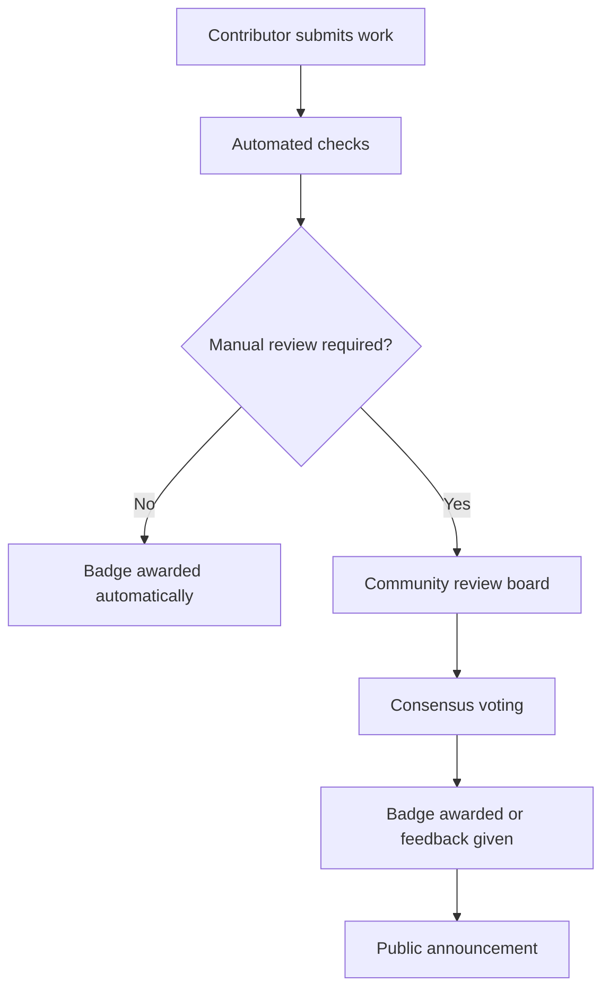
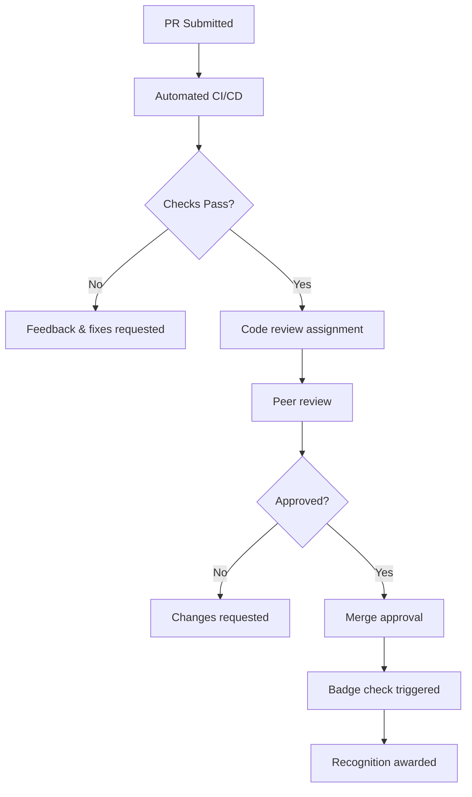

# Contributor Recognition & Governance

This document outlines how NeuroSwarm recognizes and empowers contributors, establishes transparent governance processes, and scales community participation through structured programs.

## Overview

Building on the [Contributor Playbooks](../playbooks/), this framework ensures contributors are recognized for their work and empowered to shape the project's future through transparent governance.

## 🎖️ Contributor Recognition System

### Recognition Tiers

Contributors earn recognition badges by completing playbook tasks and contributing to the ecosystem:

#### 🏅 Core Contributor Badges

**Validator Deployer** - Bronze Badge
- ✅ Deployed 1+ validator nodes in production
- ✅ Completed [Adding Validator Node](../playbooks/adding-validator.md) playbook
- ✅ Maintained validator uptime >99% for 30 days
- *Reward:* Exclusive validator-only Discord channel, priority support

**Indexer Extender** - Silver Badge
- ✅ Extended indexer with new search/filter capabilities
- ✅ Completed [Extending Indexer](../playbooks/extending-indexer.md) playbook
- ✅ Added 2+ new API endpoints or features
- ✅ Achieved >90% test coverage for new code
- *Reward:* Co-authorship on technical blog posts, feature naming rights

**Test Champion** - Gold Badge
- ✅ Implemented comprehensive test suites
- ✅ Completed [Writing Tests](../playbooks/writing-tests.md) playbook
- ✅ Maintained >85% overall code coverage
- ✅ Identified and fixed 5+ critical bugs through testing
- *Reward:* Code review authority, automated testing mentorship

#### 🏆 Advanced Contributor Badges

**Network Architect** - Platinum Badge
- ✅ Designed and implemented network improvements
- ✅ Optimized P2P sync performance by >50%
- ✅ Contributed to protocol-level changes
- *Reward:* Protocol design input, conference speaking opportunities

**Security Guardian** - Diamond Badge
- ✅ Conducted security audits or penetration testing
- ✅ Implemented security hardening measures
- ✅ Maintained zero critical vulnerabilities for 6+ months
- *Reward:* Security advisory board membership, bug bounty priority

**Community Builder** - Emerald Badge
- ✅ Organized 3+ community events or workshops
- ✅ Mentored 5+ new contributors
- ✅ Created educational content (tutorials, videos)
- *Reward:* Community leadership role, event organization budget

### Badge Verification Process



### Badge Benefits

- **Profile Recognition**: Badges displayed on GitHub profiles and community forums
- **Voting Rights**: Higher-tier badges get weighted votes in governance decisions
- **Resource Access**: Exclusive channels, tools, and early feature access
- **Professional Development**: Speaking opportunities, certifications, networking
- **Economic Incentives**: Priority access to NST token distributions and grants

## 🏛️ Governance Framework

### Decision-Making Process

NeuroSwarm uses a hybrid governance model combining technical meritocracy with community participation:

#### 1. Technical Decisions (Code & Protocol)

**Lightweight Process:**
- Technical maintainers have merge authority for non-controversial changes
- Changes requiring discussion use GitHub Discussions or Discord
- Consensus required for breaking changes

**Heavyweight Process:**
- RFC (Request for Comments) process for major protocol changes
- 2-week community review period
- Technical committee final approval

#### 2. Strategic Decisions (Roadmap & Vision)

**Community Voting:**
- Major roadmap decisions use quadratic voting
- Badge-weighted voting system
- Minimum 30-day deliberation period
- 2/3 supermajority required for approval

### Contribution Review Process



#### Code Review Guidelines

**Reviewers must check:**
- ✅ Code follows established patterns and architecture
- ✅ Comprehensive test coverage (>80%)
- ✅ Documentation updated
- ✅ Security implications addressed
- ✅ Performance impact assessed
- ✅ Breaking changes clearly communicated

**Review Timeline:**
- Initial review within 48 hours
- Follow-up reviews within 24 hours
- Stale PRs after 7 days require re-review

### Conflict Resolution

**Escalation Path:**
1. **Peer Discussion**: Contributors discuss directly
2. **Maintainer Mediation**: Technical maintainers facilitate
3. **Community Vote**: If consensus can't be reached
4. **Technical Committee**: Final arbitration for critical issues

**Principles:**
- Technical merit over personal preference
- Data-driven decisions where possible
- Respectful communication required
- No personal attacks tolerated

## 🌍 Community Scaling Programs

### Workshop Templates

#### Validator Deployment Workshop (4 hours)

**Objective:** Enable participants to deploy production validator nodes

**Curriculum:**
1. **Hour 1:** NeuroSwarm architecture overview
2. **Hour 2:** [Adding Validator Node](../playbooks/adding-validator.md) walkthrough
3. **Hour 3:** Hands-on deployment in cloud environment
4. **Hour 4:** Monitoring setup and troubleshooting

**Materials Needed:**
- Cloud credits (AWS/GCP/Azure)
- Pre-configured workshop environment
- Mentor support (1:5 ratio)

**Success Metrics:**
- 80% of participants successfully deploy validators
- Post-workshop survey satisfaction >4.5/5

#### Indexer Extension Hackathon (2 days)

**Objective:** Build new search and indexing capabilities

**Structure:**
- **Day 1:** Technical deep-dive and team formation
- **Day 2:** Implementation and presentation

**Challenges:**
1. **Beginner:** Add basic metadata filtering
2. **Intermediate:** Implement aggregation endpoints
3. **Advanced:** Add real-time indexing features

**Prizes:**
- 🥇 $5,000 NST + "Indexer Extender" badge
- 🥈 $2,500 NST + mentorship session
- 🥉 $1,000 NST + community recognition

### Enterprise Pilot Program

**Target:** Large organizations interested in private NeuroSwarm deployments

**Program Structure:**
1. **Assessment Phase** (2 weeks)
   - Technical evaluation
   - Requirements gathering
   - Pilot scope definition

2. **Implementation Phase** (4-6 weeks)
   - Guided deployment using playbooks
   - Custom feature development
   - Integration with existing systems

3. **Evaluation Phase** (2 weeks)
   - Performance testing
   - User feedback collection
   - Success metrics analysis

**Benefits for Enterprises:**
- Dedicated technical support
- Custom feature development
- Priority access to new releases
- Co-marketing opportunities

### Community Event Toolkit

#### Meetup Template

**Structure:**
- 5 min: Welcome and NeuroSwarm overview
- 15 min: Live demo of key features
- 20 min: Contributor spotlight (badge showcase)
- 15 min: Q&A and networking

**Materials:**
- Demo environment (pre-configured)
- Swag (stickers, badges)
- Presentation slides
- Networking icebreakers

#### Virtual Hackathon Guide

**Timeline:**
- **Week 1:** Challenge announcement and team formation
- **Week 2:** Development and mentoring sessions
- **Week 3:** Final submissions and judging
- **Week 4:** Winners announcement and celebration

**Virtual Tools:**
- Discord for communication
- GitHub for submissions
- Zoom for mentoring sessions
- Miro for brainstorming

## 📊 Recognition Dashboard

### Public Leaderboards

**Monthly Rankings:**
- Most active contributors
- Highest impact PRs
- Most badges earned
- Community engagement metrics

**Badge Distribution:**
```
Validator Deployer: ████████░░ 45 earned
Indexer Extender:  ██████░░░░ 32 earned
Test Champion:     ████░░░░░░ 18 earned
Network Architect: ██░░░░░░░░ 8 earned
Security Guardian: █░░░░░░░░░ 4 earned
Community Builder: █░░░░░░░░░ 3 earned
```

### Impact Metrics

**Code Quality:**
- Test coverage: 87% (target: 85%+)
- Security vulnerabilities: 0 critical
- Performance benchmarks: +23% improvement

**Community Health:**
- Active contributors: 156
- Monthly PRs: 47
- Community satisfaction: 4.7/5

## 🎯 Getting Started

### For New Contributors

1. **Complete a Playbook**: Start with any [contributor playbook](../playbooks/)
2. **Submit Your Work**: Open a PR with your implementation
3. **Earn Recognition**: Receive badges and community acknowledgment
4. **Get Involved**: Join governance discussions and community events

### For Organizations

1. **Host a Workshop**: Use our templates to organize local events
2. **Sponsor Challenges**: Fund hackathons and development bounties
3. **Join Enterprise Program**: Participate in pilot deployments

## 📈 Continuous Improvement

### Feedback Loops

**Monthly Review:**
- Badge system effectiveness
- Governance process efficiency
- Community satisfaction surveys
- Program participation metrics

**Annual Assessment:**
- Comprehensive governance review
- Badge system updates
- New program development
- Strategic planning for growth

### Evolution Process

**Badge Updates:**
- Community proposals for new badges
- Usage analytics to identify gaps
- Regular review of badge criteria

**Governance Refinement:**
- Process efficiency monitoring
- Conflict resolution case studies
- Decision quality assessment

---

**This framework ensures NeuroSwarm scales sustainably while maintaining quality and community engagement. Contributors are empowered to shape the project while receiving meaningful recognition for their work.**

*Last updated: November 2025*