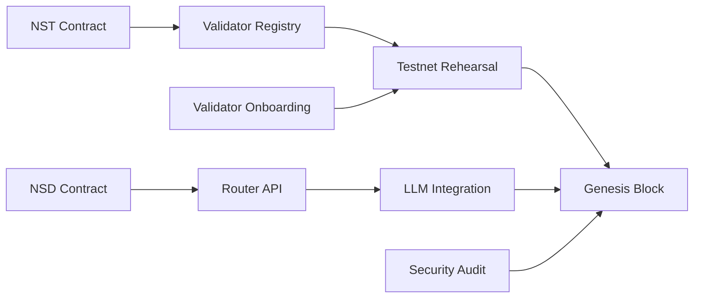

# NeuroSwarm Mainnet Launch Roadmap
## 4-Week Sprint to Genesis: January 3, 2026

> **CRITICAL**: This is an aggressive, compressed timeline requiring immediate action. All phases must execute in parallel where possible with ruthless prioritization of core deliverables.

## Executive Summary

**Launch Date:** January 3, 2026 (LOCKED)  
**Sprint Duration:** ~4 weeks (Late Nov/Early Dec 2025 → Jan 3, 2026)  
**Critical Path:** Consensus Layer → LLM Integration → Security Review → Genesis  
**Risk Level:** HIGH (compressed timeline)

## Core Principles

1. **Ship Core, Defer Non-Essential**: Only features required for mainnet launch
2. **Parallel Execution**: All phases overlap where possible
3. **Daily Progress Reviews**: Blockers resolved within 24 hours
4. **Security First**: No launch without minimum security validation

---

## Phase 1: Consensus Foundation (Week 1)
**Duration:** December 2-8, 2025  
**Owner:** Core Protocol Team  
**Status:** 🔴 CRITICAL PATH

### Objectives
- Finalize PoS consensus implementation
- Lock validator staking mechanisms
- Implement NST minting and distribution

### Deliverables
- [x] **NST Smart Contract** (Solana): Minting, staking, rewards distribution
- [ ] **Validator Registry**: On-chain validator registration and stake tracking
- [ ] **Block Production**: 8.5s finality with BFT consensus
- [ ] **Reward Algorithm**: 0.5 NST per block, halving logic implemented
- [ ] **Slashing Logic**: 50% penalty for double-signing

### Acceptance Criteria
- ✅ 10 validators running stable testnet for 48+ hours
- ✅ Block finality consistently <10s
- ✅ Zero consensus failures under stress test (1000 TPS)

---

## Phase 2: LLM Integration Layer (Week 1-2)
**Duration:** December 2-15, 2025  
**Owner:** LLM Integration Team  
**Status:** 🔴 CRITICAL PATH

### Objectives
- Implement NSD burning mechanism for LLM requests
- Create request routing layer
- Integrate with NS-LLM backend

### Deliverables
- [ ] **NSD Smart Contract**: Mint/burn logic, fiat peg oracle integration
- [ ] **Router API**: `/llm/generate` endpoint with NSD burning
- [ ] **Request Queue**: Priority queue based on NSD burn amount
- [ ] **NS-LLM Integration**: Direct integration with existing NS-LLM service
- [ ] **Rate Limiting**: Per-user limits to prevent spam
- [ ] **Monitoring Dashboard**: Real-time LLM usage and NSD burn metrics

### Architecture
```
User → Router API (burn NSD) → Priority Queue → NS-LLM Backend → Response
         ↓
    NSD Contract (burn event)
```

### Acceptance Criteria
- ✅ NSD burning reduces user balance atomically
- ✅ LLM requests processed in <5s for 95th percentile
- ✅ Failed requests refund NSD automatically
- ✅ Dashboard shows real-time burn rate and queue depth

---

## Phase 3: Security Hardening (Week 2-3)
**Duration:** December 9-22, 2025  
**Owner:** Security Team  
**Status:** 🟡 HIGH PRIORITY

### Objectives
- Rapid security audit of NST/NSD contracts
- Penetration testing on core APIs
- Rate limiting and DDoS protection

### Deliverables
- [ ] **Smart Contract Audit**: External auditor review (compressed 1-week timeline)
- [ ] **Penetration Test**: API endpoints, consensus vulnerabilities
- [ ] **Rate Limiting**: Cloudflare/Gateway level protection
- [ ] **Emergency Kill Switch**: Pause mechanism for critical vulnerabilities
- [ ] **Bug Bounty Program**: $50K pool for critical findings

### Acceptance Criteria
- ✅ Zero critical vulnerabilities in smart contracts
- ✅ API withstands 10,000 RPS DDoS simulation
- ✅ Emergency pause tested and documented

---

## Phase 4: Validator Onboarding (Week 2-4)
**Duration:** December 9-31, 2025  
**Owner:** Community & DevRel  
**Status:** 🟢 PARALLEL TRACK

### Objectives
- Recruit minimum 50 validators
- Provide setup documentation and support
- Execute validator dry run

### Deliverables
- [ ] **Validator Guide**: Step-by-step setup instructions
- [ ] **Staking Dashboard**: Web UI for validator registration
- [ ] **Support Channel**: Discord/Telegram for validator onboarding
- [ ] **Testnet Rehearsal**: Full genesis simulation with 50+ validators
- [ ] **Incentive Program**: Early validator rewards announced

### Acceptance Criteria
- ✅ 50+ validators registered and staked
- ✅ All validators complete testnet rehearsal successfully
- ✅ <5% validator dropout during dry run

---

## Phase 5: Mainnet Genesis (Week 4)
**Duration:** December 26, 2025 - January 3, 2026  
**Owner:** Core Team + Validators  
**Status:** 🔴 LAUNCH WINDOW

### Pre-Genesis Checklist (Dec 26-31)
- [ ] **Final Code Freeze**: No changes after Dec 26, 11:59 PM UTC
- [ ] **Validator Sync**: All validators upgrade to genesis binary
- [ ] **Token Distribution**: Initial NST allocation to validators
- [ ] **Monitoring**: Grafana/Prometheus dashboards live
- [ ] **Communication**: Launch announcement published

### Genesis Day: January 3, 2026
**Timeline (UTC)**

| Time | Event | Owner |
|:-----|:------|:------|
| 00:00 | **Genesis Block Produced** | Core Team |
| 00:01-01:00 | First 424 blocks validated | Validator Network |
| 01:00 | Block explorer live | Infra Team |
| 02:00 | LLM Router API enabled | LLM Team |
| 04:00 | Public API endpoints open | DevRel |
| 12:00 | Official launch announcement | Marketing |
| 24:00 | First 10,176 blocks milestone | Network |

### Post-Genesis Monitoring (Jan 3-10)
- [ ] **Hour 1-24**: Critical incident response team on call
- [ ] **Day 1-7**: Daily health reports published
- [ ] **Week 1**: First governance proposal window opens
- [ ] **Week 2**: Community AMA and feedback session

---

## Deferred to Post-Launch

The following features are **intentionally excluded** from the Jan 3, 2026 launch to meet the deadline:

### Deferred Features
- ❌ **Multi-Modal LLM Support** (images, audio) → Q1 2026
- ❌ **Advanced Governance** (multi-sig, quadratic voting) → Q2 2026
- ❌ **Mobile Apps** (iOS/Android) → Q2 2026
- ❌ **Enterprise SLAs** → Q3 2026
- ❌ **Cross-Chain Bridges** → Q4 2026

### MVP Scope (Launch Day)
- ✅ PoS consensus with NST staking
- ✅ Text-only LLM inference via NSD burning
- ✅ Basic governance (proposal submission)
- ✅ Web dashboard (validator metrics, LLM usage)
- ✅ Block explorer

---

## Risk Mitigation

### High-Risk Items
1. **Smart Contract Bugs** → External audit + bug bounty
2. **Validator Coordination** → Testnet rehearsals + clear runbooks
3. **LLM Backend Failures** → Circuit breaker + automatic failover
4. **DDoS Attacks** → Cloudflare + rate limiting + emergency pause

### Contingency Plans
- **Code Freeze Violation**: Immediate rollback, 24h delay
- **Security Critical Found**: Emergency patch, restart genesis countdown
- **<50 Validators**: Delay launch, extend recruitment by 1 week
- **Consensus Failure**: Activate backup validator set, debug in staging

---

## Success Metrics (Week 1 Post-Launch)

| Metric | Target | Measurement |
|:-------|:-------|:------------|
| **Uptime** | >99.9% | Block production continuity |
| **Validator Participation** | >90% | Active validators / total staked |
| **LLM Requests** | >1,000/day | NSD burn events |
| **Block Finality** | <10s avg | Block explorer metrics |
| **Critical Incidents** | 0 | Severity 1 issues |

---

## Communication Plan

### Internal
- **Daily Standups**: 9 AM UTC, all teams (15 min max)
- **Blocker Channel**: Slack #launch-blockers (24/7 monitoring)
- **Decision Log**: All major decisions documented

### External
- **Dec 10**: Launch date announcement + validator recruitment
- **Dec 20**: Technical deep dive webinar
- **Dec 31**: Final "Genesis Eve" update
- **Jan 3**: Live launch stream + official announcement
- **Jan 10**: Week 1 retrospective published

---

## Critical Path Dependencies



**Longest Path:** NST Contract → Validator Registry → Testnet → Genesis (14 days minimum)

---

## Team Assignments

| Phase | Lead | Team Size | Critical Skills |
|:------|:-----|:----------|:----------------|
| Consensus | @core-protocol | 3 engineers | Rust, Consensus algorithms |
| LLM Integration | @llm-team | 2 engineers | TypeScript, Solana SDK |
| Security | @security-team | 2 engineers + 1 auditor | Smart contract security, pentesting |
| Validator Onboarding | @devrel | 2 DevRel | Documentation, community management |
| Infra & Monitoring | @infra | 2 DevOps | Kubernetes, Prometheus, Grafana |

---

## Open Questions (Immediate Resolution Required)

1. **NSD Oracle**: Which price feed for fiat peg? (Chainlink vs Pyth vs Manual)
2. **Validator Minimum Stake**: Confirm 5,000 NST or adjust for initial launch?
3. **LLM Model**: Which model(s) available at genesis? (GPT-2, Llama, both?)
4. **Emergency Contacts**: Who has authority to trigger pause contract?

---

**Last Updated:** November 30, 2025  
**Next Review:** December 2, 2025 (Daily thereafter)  
**Owner:** Agent 5 (Scrum Master) + Agent 4 (Full Stack Dev)

---

## Immediate Next Steps (This Week)

### Priority 1: LLM Integration Design
**Owner:** Agent 4  
**Deadline:** December 5, 2025

Design the NSD burning and LLM request routing logic:
1. Define NSD burn rate per token/request
2. Design priority queue algorithm
3. Specify NS-LLM integration API
4. Create request/response flow diagrams

### Priority 2: Validator Recruitment Campaign
**Owner:** DevRel Team  
**Deadline:** December 8, 2025

Launch validator onboarding:
1. Publish validator requirements and rewards
2. Create setup guide and video tutorials
3. Open registration form
4. Schedule office hours for questions

### Priority 3: Security Audit RFP
**Owner:** Security Team  
**Deadline:** December 3, 2025

Engage external auditor:
1. Send RFP to 3 audit firms
2. Select firm with fastest turnaround
3. Provide contract code + documentation
4. Schedule kick-off call

---

**🚨 CRITICAL: This is an extremely aggressive timeline. Daily progress tracking and immediate blocker resolution are non-negotiable. Any slippage in Phase 1 or 2 jeopardizes the January 3, 2026 launch date. 🚨**
