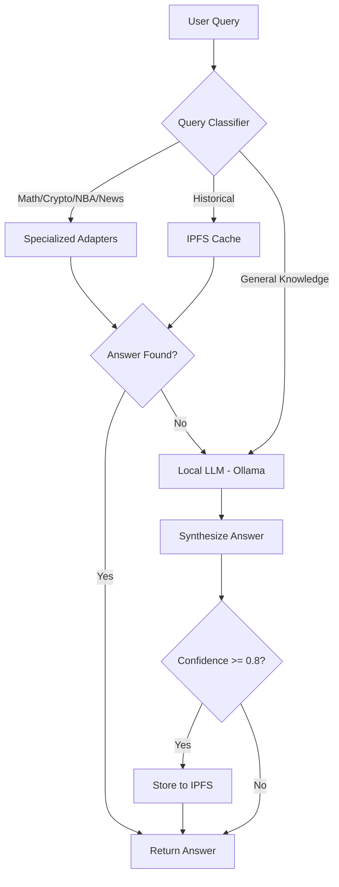

# Local LLM Setup Guide for NeuroSwarm

## Overview
This guide walks you through setting up a fully local, decentralized knowledge retrieval pipeline using Ollama instead of OpenAI.

## Prerequisites
- Windows, macOS, or Linux
- At least 8GB RAM (16GB recommended for larger models)
- 10GB+ free disk space for models

## Step 1: Install Ollama

### Windows
1. Download Ollama from [ollama.ai](https://ollama.ai)
2. Run the installer
3. Verify installation:
   ```powershell
   ollama --version
   ```

### macOS/Linux
```bash
curl -fsSL https://ollama.ai/install.sh | sh
```

## Step 2: Pull a Model

### Recommended Models

**llama3.2** (Recommended for NeuroSwarm)
- Size: ~2GB
- Good balance of speed and quality
- Excellent for general knowledge queries
```powershell
ollama pull llama3.2
```

**mistral** (REMOVED_BY_POLICY)
- Removed from repository per project policy.

**gemma:2b** (Lightweight)
- Size: ~1.4GB
- Fastest, good for resource-constrained systems
```powershell
ollama pull gemma:2b
```

## Step 3: Start Ollama Service

### Windows
Ollama runs as a background service automatically after installation. Verify it's running:
```powershell
curl http://localhost:11434/api/tags
```

### macOS/Linux
```bash
ollama serve
```

## Step 4: Test the Model

```powershell
ollama run llama3.2 "What is the capital of Peru?"
```

Expected output: "The capital of Peru is Lima."

## Step 5: Configure NeuroSwarm

The `local-llm` adapter is already configured to use Ollama at `http://localhost:11434`. No code changes needed!

### Verify Configuration
Check `sources/adapters/local-llm.js`:
```javascript
const endpoint = process.env.LOCAL_LLM_ENDPOINT || 'http://localhost:11434/v1/chat/completions';
```

## Step 6: Test Integration

1. Start ns-node:
   ```powershell
   cd c:/JS/ns/neuroswarm/ns-node
   node server.js
   ```

2. Open chat interface: `http://localhost:3009`

3. Test queries:
   - "What is the capital of France?" (should use local LLM)
   - "Explain quantum computing" (should synthesize with local LLM)
   - "What is 2+2?" (should use math adapter, not LLM)

## Retrieval Pipeline (Fully Local)



## Benefits of Local LLM

✅ **Privacy**: All data stays on your machine
✅ **No API Costs**: Free to use, unlimited queries
✅ **Offline Capable**: Works without internet (after model download)
✅ **Customizable**: Swap models based on performance needs
✅ **Decentralized**: Aligns with NeuroSwarm's philosophy
✅ **Auditable**: Full control over model behavior

## Performance Tuning

### Model Selection
**Quality Priority**: Use `llama3.1:8b` or other supported high-quality models

### Hardware Optimization
- **GPU Acceleration**: Ollama automatically uses GPU if available (NVIDIA/AMD)
- **RAM**: Larger models require more RAM (8GB minimum, 16GB recommended)
- **CPU**: Multi-core CPUs improve response time

## Troubleshooting

### Ollama Not Running
```powershell
# Check if Ollama is running
curl http://localhost:11434/api/tags

# If not, restart the service (Windows)
# Ollama runs automatically as a service

# macOS/Linux
ollama serve
```

### Model Not Found
```powershell
# List installed models
ollama list

# Pull the model if missing
ollama pull llama3.2
```

### Slow Responses
- Try a smaller model (`gemma:2b`)
- Ensure GPU drivers are up to date
- Close other resource-intensive applications

## Next Steps

1. ✅ Install Ollama
2. ✅ Pull `llama3.2` model
3. ✅ Verify service is running
4. ✅ Test with NeuroSwarm chat
5. 🚀 Run Test Suite 3 (LLM Synthesis)
6. 🚀 Validate IPFS caching with LLM responses
7. 🚀 Proceed to Phase 2a (Confidence Scoring)

## Additional Resources

- [Ollama Documentation](https://github.com/ollama/ollama)
- [Model Library](https://ollama.ai/library)
- [NeuroSwarm Knowledge System Design](./knowledge-system/readme.md)
