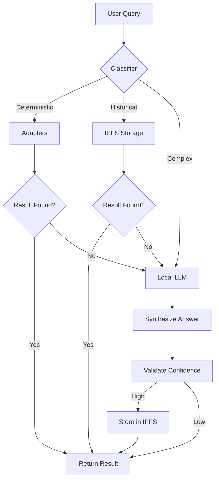

# Knowledge Retrieval Pipeline Design

## Overview
This document outlines the design for the NeuroSwarm Knowledge Retrieval Pipeline. The system is designed to provide accurate, verifiable, and efficient answers by orchestrating multiple data sources: specialized adapters, decentralized knowledge storage (IPFS), and local Large Language Models (LLMs).

## Retrieval Order
The pipeline follows a strict hierarchy to ensure efficiency and accuracy:

1.  **Specialized Adapters (Deterministic)**
    *   **Purpose**: Handle queries with precise, real-time, or calculable answers.
    *   **Examples**: Math calculations, Crypto prices (CoinGecko), Weather, Sports scores.
    *   **Action**: If an adapter returns a high-confidence result, return immediately.

2.  **IPFS Knowledge Storage (Persistent)**
    *   **Purpose**: Retrieve previously validated answers and governance logs.
    *   **Mechanism**: Query Helia/IPFS using semantic embeddings or keyword hashes.
    *   **Action**: If a matching, high-confidence record is found, return the stored answer.

3.  **Local LLM (Reasoning & Synthesis)**
    *   **Purpose**: Synthesize information, handle complex reasoning, or provide fallback answers.
    *   **Inputs**: User query + Context from Adapters (if partial) + Context from IPFS.
    *   **Action**: Generate a coherent response based on available context.

4.  **Integration & Validation**
    *   **Purpose**: Combine sources into a final response.
    *   **Action**: The LLM formats the final output, citing sources (e.g., "According to CoinGecko...").

5.  **Storage (Learning)**
    *   **Purpose**: Improve future performance.
    *   **Action**: High-confidence, validated answers are stored back into IPFS.

## Query Classification
Queries are classified into three types to determine the routing:

*   **Type A: Deterministic** (e.g., "What is 2+2?", "Price of BTC") -> Route to **Adapters**.
*   **Type B: Historical/Governance** (e.g., "What was proposal 123?") -> Route to **IPFS**.
*   **Type C: Generative/Complex** (e.g., "Explain the impact of...") -> Route to **LLM** (with IPFS context).

## Integration Flow


## Storage & Logging
*   **Storage Engine**: Helia (IPFS implementation for JS).
*   **Data Structure**:
    ```json
    {
      "query_hash": "sha256...",
      "embedding": [0.1, 0.2, ...],
      "answer": "The answer text...",
      "source": "adapter_name" | "llm_model",
      "confidence": 0.95,
      "timestamp": "ISO8601",
      "validations": 0
    }
    ```
*   **Logging**: All retrieval attempts and their sources are logged to the local governance log for transparency.

## Testing Strategy

Before implementing Phase 2 enhancements, the current pipeline must be thoroughly tested:

### Test Suite 1: Deterministic Queries
**Purpose**: Validate adapter routing and response formatting.

| Query | Expected Adapter | Expected Result |
|-------|-----------------|-----------------|
| "What is 2+2?" | `math-calculator` | Instant calculation result |
| "Price of BTC" | `coingecko` | Current Bitcoin price |
| "NBA scores today" | `nba-scores` | Live/recent game scores |
| "Latest news" | `news-aggregator` | Top headlines |

**Success Criteria**: Each query routes to the correct adapter and returns a properly formatted response.

### Test Suite 2: IPFS Cache Performance
**Purpose**: Validate storage and retrieval from IPFS.

1. **Cache Miss**: Ask a novel question → Verify it's answered and stored to IPFS
2. **Cache Hit**: Ask the same question again → Verify it's retrieved from IPFS (faster response)
3. **Storage Validation**: Check IPFS logs to confirm high-confidence answers are stored
4. **Retrieval Speed**: Measure response time for cached vs. uncached queries

**Success Criteria**: Cache hits are significantly faster; storage only occurs for confidence ≥ 0.8.

### Test Suite 3: LLM Synthesis
**Purpose**: Validate context collection and LLM integration.

| Query Type | Test Query | Expected Behavior |
|------------|-----------|-------------------|
| Ambiguous | "Explain quantum computing" | LLM synthesizes answer |
| With Context | "What's the ROI of BTC?" (after price query) | LLM uses CoinGecko context |
| Uncertain | "Will it rain tomorrow?" | LLM admits uncertainty or uses weather adapter |

**Success Criteria**: LLM receives collected context; answers are coherent and cite sources when applicable.

### Test Suite 4: Fallback Chain
**Purpose**: Ensure graceful degradation when services fail.

1. **Local LLM Offline**: Stop Ollama → Verify fallback to OpenAI
2. **Both LLMs Offline**: Stop both → Verify generic fallback message
3. **Adapter Failure**: Simulate CoinGecko timeout → Verify LLM fallback
4. **Network Failure**: Disconnect internet → Verify IPFS cache still works

**Success Criteria**: No crashes; users always receive a response (even if it's "service unavailable").

### Test Documentation
After each test suite, document:
- ✅ Pass/Fail status
- Response times
- Error logs (if any)
- Unexpected behaviors
- Recommendations for improvement

## Safeguards
1.  **Redundancy Check**: Check IPFS before calling expensive external APIs or LLM generation.
2.  **Stale Data Prevention**: IPFS records include a TTL (Time To Live) or validity timestamp. Expired records trigger a fresh fetch.
3.  **Hallucination Mitigation**: The LLM is instructed to prioritize provided context (Adapters/IPFS) over its internal training data.
4.  **Rate Limiting**: External adapter calls are rate-limited to prevent API bans.

## Roadmap

    - Weight adapter contributions based on relevance

- [ ] **Governance Logging**:
    - Log all retrieval decisions to governance logs
    - Track which adapters were queried and why
    - Record confidence scores and storage decisions
    - Enable audit trail for transparency
    - Anchor critical decisions to blockchain

### Phase 4: Optimization
- [ ] Add feedback mechanism for users to validate/invalidate IPFS records
- [ ] Implement TTL (Time To Live) for time-sensitive data
- [ ] Add rate limiting and caching for external APIs
- [ ] Optimize LLM context window usage

